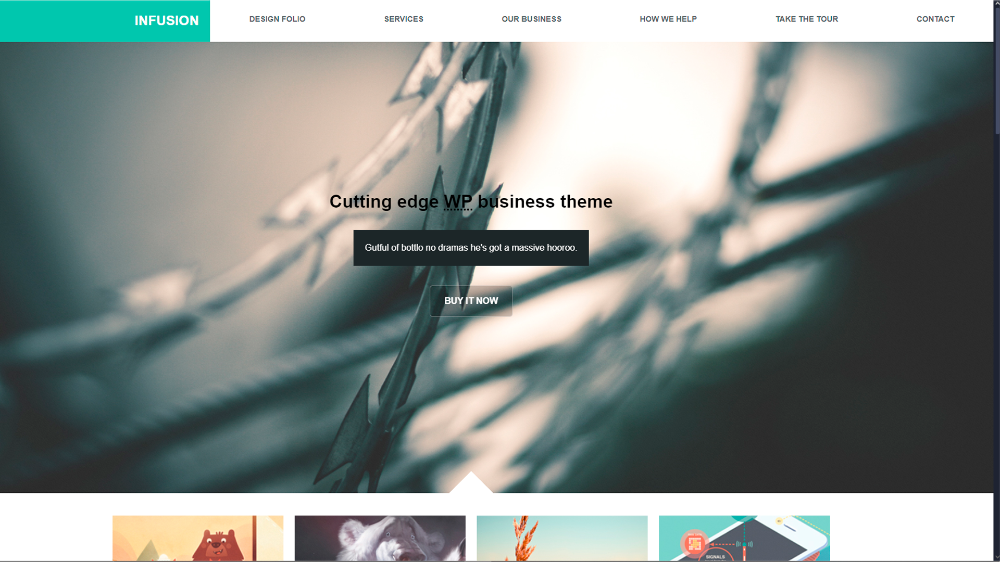

Infusion is a project developed as part of a frontend course I completed. It was designed using HTML, CSS, and JavaScript, allowing me to practice and strengthen my skills in each of these technologies. The project was developed with responsive design in mind, ensuring smooth and intuitive user experiences across various devices, including desktops, laptops, tablets, and smartphones.

"Infusion" served as the final project of my frontend development course, and it provided an excellent opportunity to apply everything I had learned, from creating layouts to scripting interactive features, and optimizing the project for mobile-first design.

